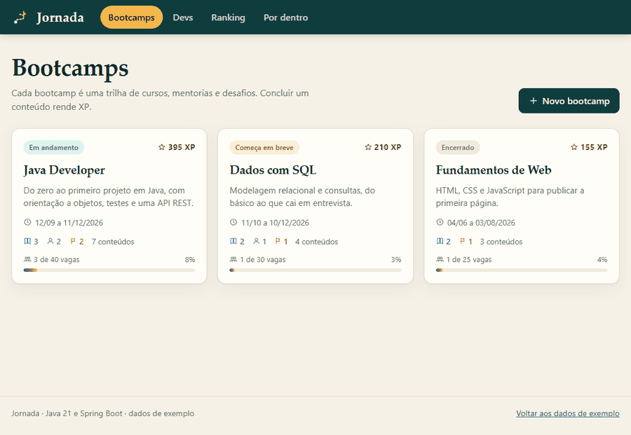
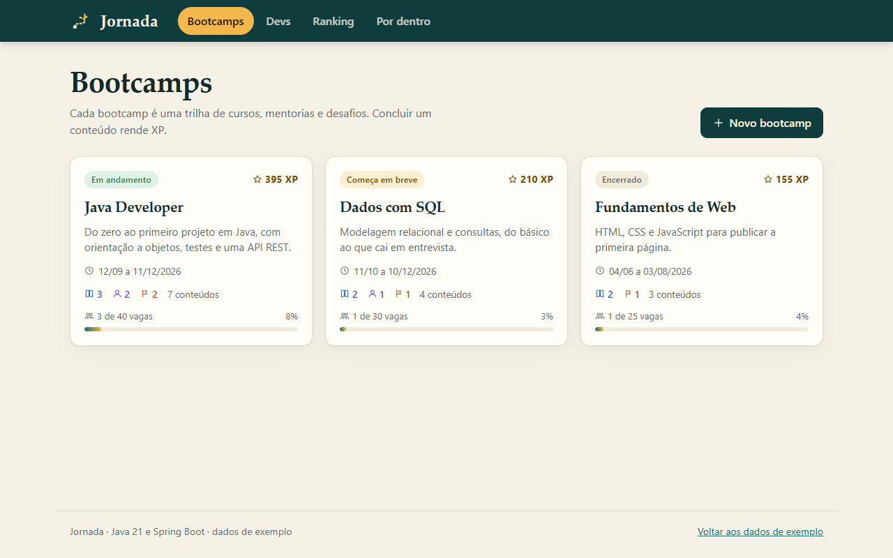
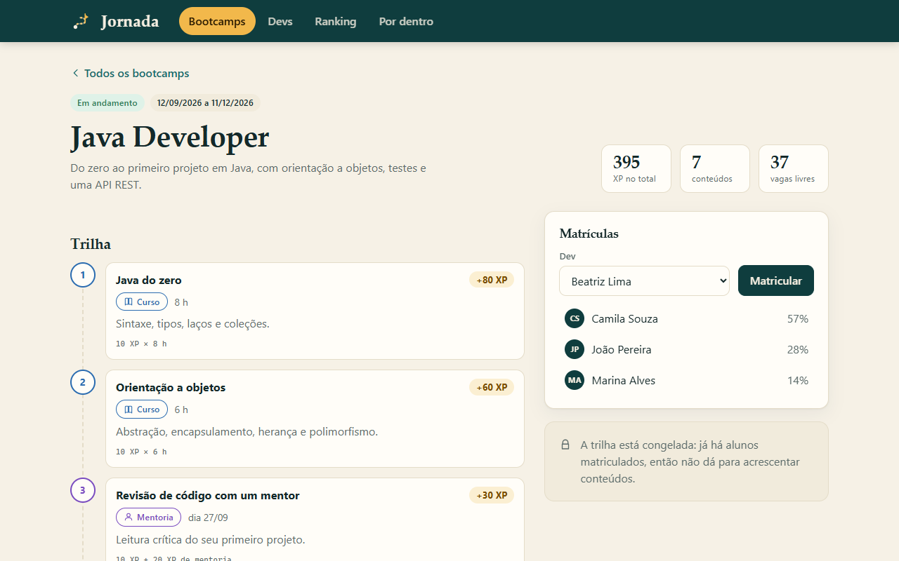
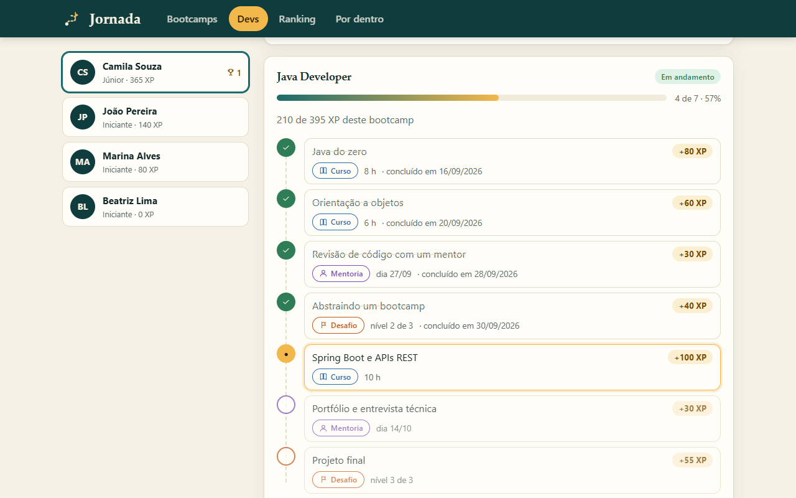
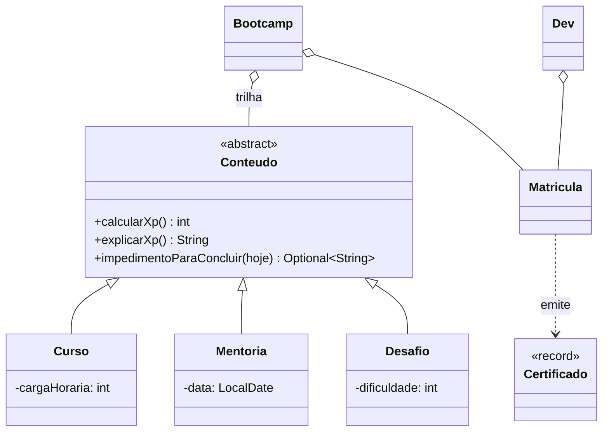

# Jornada

[](https://github.com/barbozadevti/jornada/actions/workflows/ci.yml)


Plataforma de **bootcamps**: cada bootcamp é uma trilha de cursos, mentorias e desafios; o dev se matricula, conclui os conteúdos em ordem, soma **XP**, sobe de nível, aparece no ranking e, ao terminar, recebe um **certificado** com código verificável.

O domínio é a versão completa do desafio *Abstraindo um Bootcamp Usando Orientação a Objetos em Java*, da [DIO](https://www.dio.me) (a entrega fica em [barbozadevti/java-bootcamp-poo](https://github.com/barbozadevti/java-bootcamp-poo)), e mostra os quatro pilares da POO funcionando em um sistema com API REST e interface web.

> **Apresentação interativa:** <https://barbozadevti.github.io/jornada/> — escolha a visão **recrutador** (código, testes, arquitetura, laboratório de polimorfismo e decisões) ou **CEO** (problema, simulador de retenção, ondas e riscos).



## Telas

| | |
|---|---|
|  **Bootcamps**: situação, período, vagas e XP de cada trilha |  **Trilha**: tipo, detalhe e a conta do XP de cada conteúdo |
|  **Progresso**: o próximo passo em destaque e o motivo do bloqueio, quando há |  **Certificado**: imprimível e com código conferível |
|  **Ranking** e conferência de certificados |  **Por dentro**: cada pilar da OO ligado ao código |

## Como usar

**No Windows**, o atalho `Abrir Jornada.cmd` compila na primeira vez, sobe o servidor e abre o navegador em <http://localhost:5270>.

**Pelo Maven** (JDK 21):

```bash
mvn -DskipTests package
java -jar target/jornada.jar
```

**Com Docker** (os dados ficam no volume `dados`):

```bash
docker build -t jornada .
docker run -p 5270:5270 -v dados:/dados jornada
```

Na primeira execução a Jornada traz dados de exemplo (três bootcamps e quatro devs); *Voltar aos dados de exemplo*, no rodapé, recomeça. O estado fica em `~/.jornada/jornada.json` (configurável em `jornada.arquivo`; vazio = só na memória). A documentação interativa da API está em `/swagger-ui.html`.

**Demo online:** <https://jornada-fk18.onrender.com> (hospedagem gratuita: o primeiro acesso pode levar cerca de 1 minuto para acordar; os dados de exemplo voltam a cada reinício).

**No Render** (para publicar a sua): `New > Blueprint`, aponte para este repositório; o [`render.yaml`](render.yaml) já traz a configuração (plano gratuito: os dados de exemplo voltam a cada reinício).

## Os quatro pilares no código

| Pilar | Onde aparece |
|---|---|
| **Abstração** | [`Conteudo`](src/main/java/dev/barboza/jornada/dominio/Conteudo.java) é abstrata e `sealed`: define o que todo conteúdo tem e o que sabe fazer (`calcularXp`, `explicarXp`, `impedimentoParaConcluir`). |
| **Herança** | [`Curso`](src/main/java/dev/barboza/jornada/dominio/Curso.java), [`Mentoria`](src/main/java/dev/barboza/jornada/dominio/Mentoria.java) e [`Desafio`](src/main/java/dev/barboza/jornada/dominio/Desafio.java) herdam de `Conteudo` e acrescentam só o que é deles. |
| **Polimorfismo** | Cada tipo calcula o XP do seu jeito, e [`Matricula`](src/main/java/dev/barboza/jornada/dominio/Matricula.java) e [`Dev`](src/main/java/dev/barboza/jornada/dominio/Dev.java) somam sem saber o tipo. A mentoria decide sozinha se já pode ser concluída. |
| **Encapsulamento** | Campos privados e finais, listas expostas só como visões somente-leitura, construtores que recusam dados inválidos e a trilha que congela depois da primeira matrícula ([`Bootcamp`](src/main/java/dev/barboza/jornada/dominio/Bootcamp.java)). |



O diagrama completo está em [`docs/uml/jornada.mmd`](docs/uml/jornada.mmd) (e em [imagem](docs/uml/jornada.svg)). Um teste ([`DiagramaUmlTest`](src/test/java/dev/barboza/jornada/DiagramaUmlTest.java)) lê esse arquivo e confere, por reflexão, cada classe, atributo, método, estereótipo e relação contra o código: se o diagrama divergir, o build quebra.

## Regras

| Conteúdo | XP |
|---|---|
| `Curso` | 10 por hora de carga horária |
| `Mentoria` | 10 + 20 (só conclui a partir do dia marcado) |
| `Desafio` | 10 + 15 × dificuldade (1 a 3) |

- A trilha é uma sequência: o próximo conteúdo só libera depois do anterior.
- Não se conclui nada antes de o bootcamp começar nem depois de ele terminar.
- A matrícula é recusada se o bootcamp acabou, está sem vagas, sem conteúdos ou se o dev já está nele.
- Depois da primeira matrícula a trilha não muda.
- Nível pelo XP: Iniciante, Júnior (150), Pleno (400) e Sênior (800).
- Concluir o último conteúdo emite o certificado `JRN-<dev>-<bootcamp>`, que qualquer pessoa confere.

## API

| Rota | O que faz |
|---|---|
| `GET /api/bootcamps` · `GET /api/bootcamps/{id}` | Lista e detalha, com situação, vagas, XP e trilha |
| `POST /api/bootcamps` | Cria um bootcamp |
| `POST /api/bootcamps/{id}/conteudos` | Acrescenta curso, mentoria ou desafio à trilha |
| `GET /api/devs` · `GET /api/devs/{id}` | Devs com nível, XP, matrículas e trilha percorrida |
| `POST /api/devs` | Cadastra um dev |
| `POST /api/devs/{id}/matriculas` | Matricula em um bootcamp |
| `POST /api/devs/{id}/matriculas/{bootcampId}/progresso` | Conclui o próximo conteúdo |
| `GET /api/ranking` | Ranking de XP |
| `GET /api/certificados/{codigo}` | Confere um certificado |
| `GET /api/regras-xp` | Regra de XP de cada tipo |

Os erros seguem o formato `application/problem+json` (RFC 9457): **404** não encontrado, **409** não cabe no estado atual (matrícula repetida, mentoria que ainda não aconteceu), **422** regra violada (dado inválido) e **400** corpo malformado.

## Arquitetura

```text
dominio/     Java puro, sem Spring: Conteudo, Curso, Mentoria, Desafio, Bootcamp, Matricula, Dev, Certificado...
aplicacao/   Escola (casos de uso, ids, relógio), Armazenamento (JSON em arquivo), dados de exemplo
api/         Controllers, DTOs de entrada e saída, tratamento de erros
config/      Beans, cabeçalhos de segurança (CSP) e abertura do navegador pelo atalho
static/      Interface em módulos ES, sem framework e sem nada inline
```

- **Relógio injetado**: o domínio nunca chama `LocalDate.now()`; a data entra por parâmetro, e os testes controlam o tempo.
- **Persistência por remontagem**: o arquivo guarda fatos (matrículas e conclusões, com as datas) e, ao carregar, o domínio é refeito pelos mesmos métodos, então as regras valem também para o que veio do disco. A gravação é atômica (temporário + troca).
- **Sem banco de dados**: o volume não justifica; a interface `Armazenamento` deixa a troca para depois.
- **Segurança**: política de segurança de conteúdo sem `unsafe-inline`, DOM montado com `textContent` (nunca `innerHTML`), imagem Docker com usuário sem privilégios.
- **Concorrência**: as operações da `Escola` são sincronizadas, já que o domínio é mutável.

## Testes

```bash
mvn verify
```

77 testes: regras do domínio (XP de cada tipo, encapsulamento, matrícula, mentoria com data, certificado, níveis), casos de uso e persistência (inclusive arquivo corrompido), API completa com `MockMvc` (200, 201, 400, 404, 409, 422) e o diagrama UML contra o código. O GitHub Actions roda os testes, um teste de fumaça do jar e outro do contêiner (que reinicia e confere que os dados persistiram).

## Planejamento

As decisões de produto seguem a Lean Inception: [`docs/lean-inception.md`](docs/lean-inception.md) (visão, escopo, personas, jornadas, ondas e canvas MVP).
